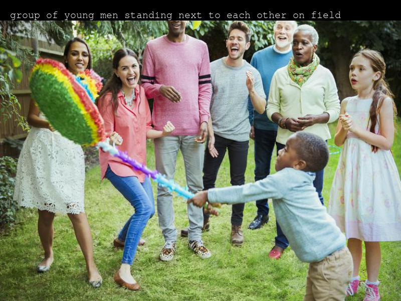
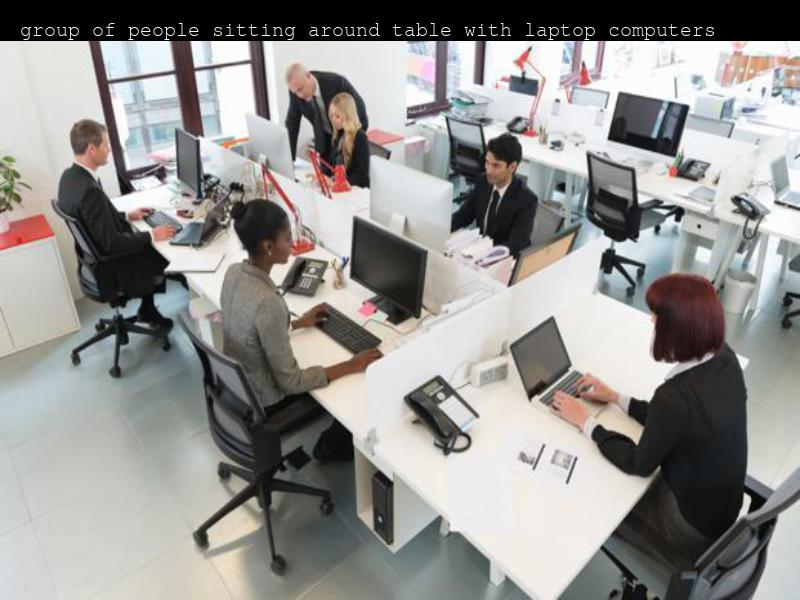
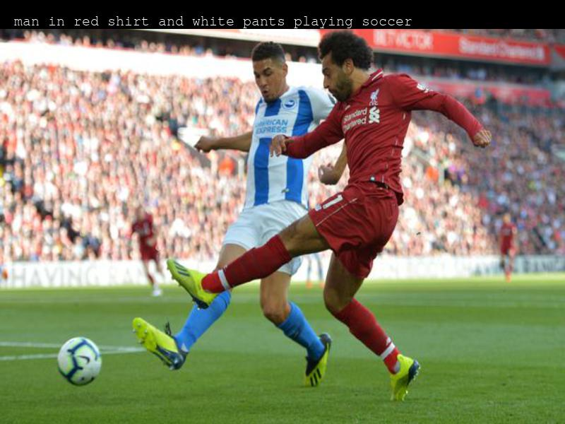
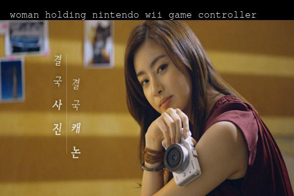
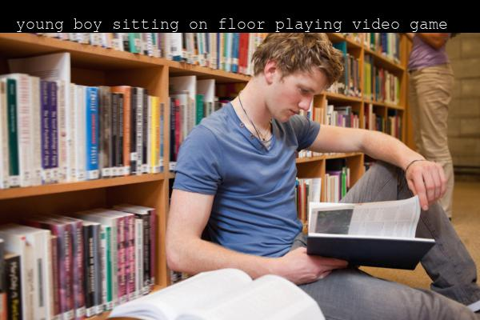
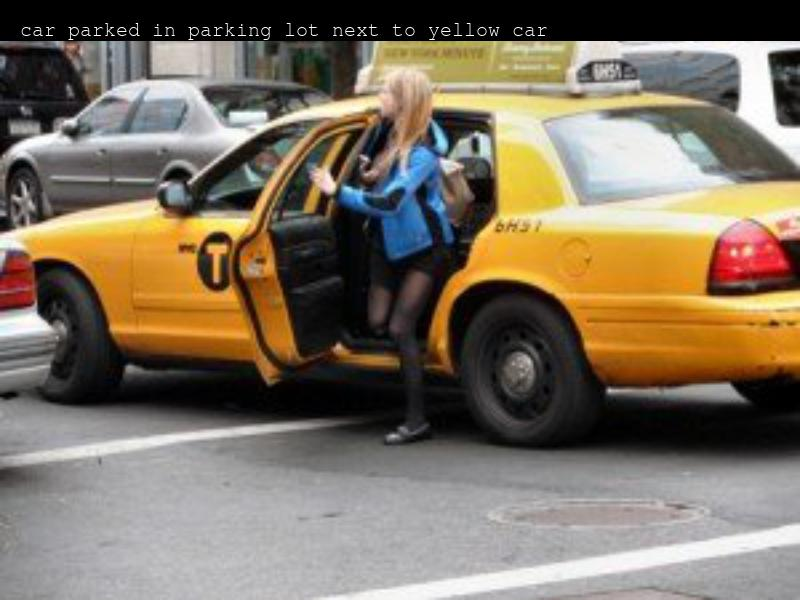
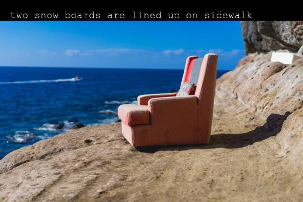
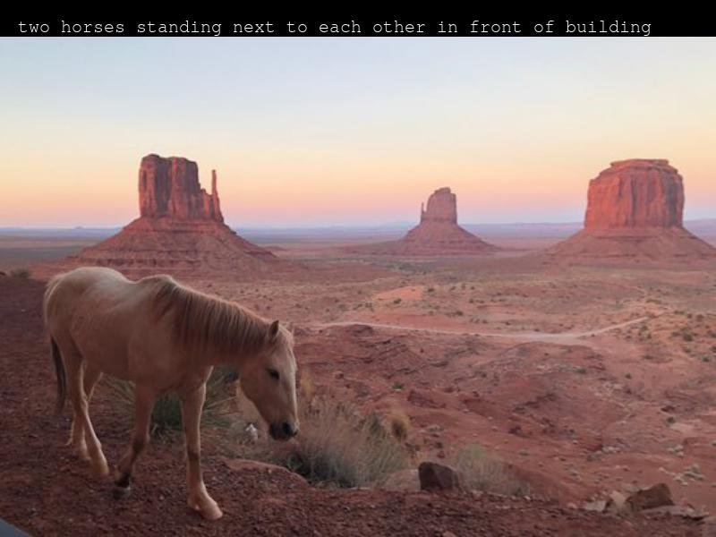

# Image Captioning with Deep Learning

This repository is an unofficial `PyTorch` implementation of the paper [_Show and Tell: A Neural Image Caption Generator_](https://arxiv.org/pdf/1411.4555.pdf).

After cloning this repository, please redirect to `instructions.md` for a quick set-up so that you are able to use our codes.

## Training details

As described in the paper, we need a `CNN` playing an encoder and a `RNN` a decoder. For `CNN`, we have tried with `VGG19, Inceptionv3, ResNet34`, the differences in result are insignificant. For `RNN`, we choose `LSTM` as said in the paper.

Hyperparameters are chosen as follows:

* `lr=1e-3`
* `batch_size=128`
* `lr-decay-rate=0.99`, strategy _exponential decay_, applied every `2000` iters
* `nb-epochs=100`
* `nb-of-LSTM-layers=2`
* `LSTM-Dropout-rate=0.7`

For evaluation metrics, we used `BLEU-n` for `n=1, 2, 3, 4`. Evaluation strategy is _beam search_: You insert image to the `CNN`, the embeddings then is passed to the `RNN`, the first token is sampled from the proba output vector and is then re-inserted to the `RNN` to get the second token, so on and so on. This procedure terminates when _END_ token is generated or the sequence length passes some limit. (Typically for NLP tasks, the training and evaluation phases are proceeded with different strategies and metrics)

With all these settings, we have achieved good `BLEU` scores: `BLEU-1=64.`, `BLEU-4=18. (max=100)` on __COCO__ dataset, though not yet comparable with the paper (same score for `BLEU-1`, but the paper gets `27.` for `BLEU-4`, which is much higher). To achieve this score, we need several hours with 60 epochs.

Some auto captions:

__Good results.__

__Results with minor errors.__

__Somewhat relevant.__

__Bad results.__

